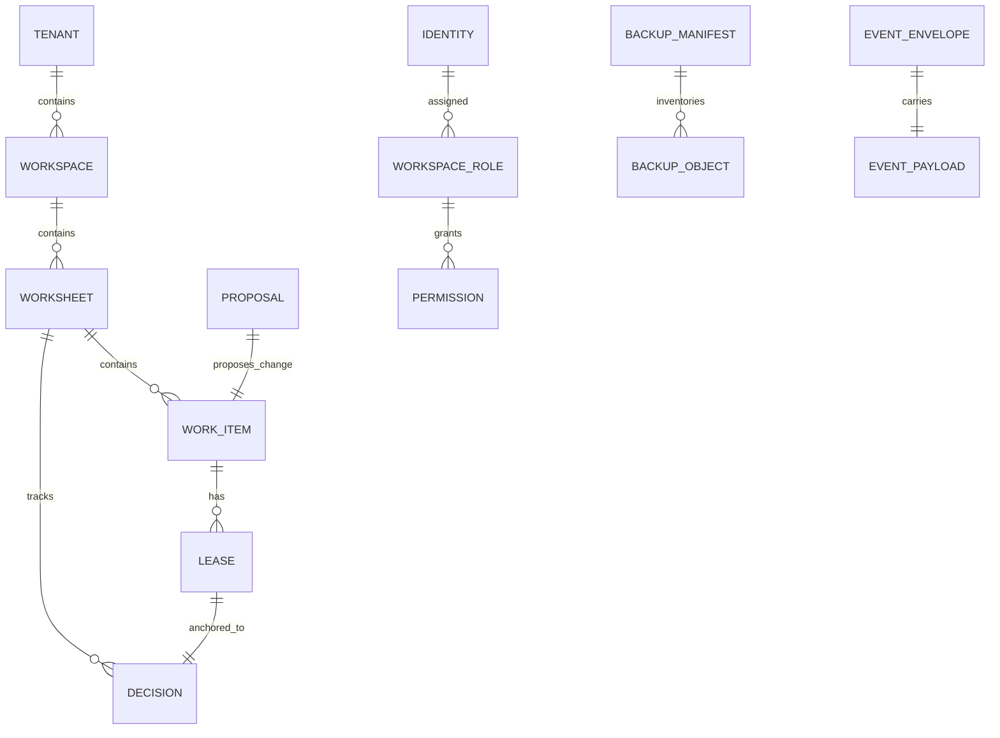

# Data Model: Work Frontier

## Worksheet

**Owned by:** [platform-persistence](modules/platform-persistence.md)

- `worksheet_id` (PK), `workspace_id` (FK), `title`, `state`, `created_at`, `updated_at`
- Relations: contains many `WorkItem`; tracks many `Decision`

## WorkItem

**Owned by:** [domain-layer](modules/domain-layer.md), persisted by [platform-persistence](modules/platform-persistence.md)

- `item_id` (PK), `worksheet_id` (FK), `title`, `ready`, `ranking_position`, `decision_id` (FK)
- Relations: has one `Lease`; target of `Proposal`

## Decision

**Owned by:** [domain-layer](modules/domain-layer.md), persisted by [platform-persistence](modules/platform-persistence.md)

- `decision_id` (PK), `decision_type`, `authority`, `freshness`, `source_revision`
- Relations: belongs to `Worksheet`; anchors `Lease`

## Lease

**Owned by:** [domain-layer](modules/domain-layer.md), persisted by [platform-persistence](modules/platform-persistence.md)

- `lease_id` (PK), `item_id` (FK), `owner`, `decision_id` (FK), `version`
- Relations: belongs to `WorkItem`; anchored to `Decision`

## Proposal

**Owned by:** [domain-layer](modules/domain-layer.md), persisted in-memory by [control-plane-api](modules/control-plane-api.md)

- `proposal_id` (PK), `actor_id`, `item_id` (FK), `base_decision_id`, `field`, `new_value`
- Relations: proposes change to `WorkItem`

## EventEnvelope

**Owned by:** [contracts](modules/contracts.md)

- `event_id` (PK), `event_type`, `tenant_id`, `workspace_id`, `causation_id`, `correlation_id`, `schema_version`
- Relations: carries one `EventPayload`

## BackupManifest

**Owned by:** [platform-operations](modules/platform-operations.md)

- `subject_sha`, `created_at`, `database_lsn`, `manifest_sha256`
- Relations: inventories many `BackupObject`

---

_Traced from actual ORM models, schemas, and domain entities on 2026-07-14._
