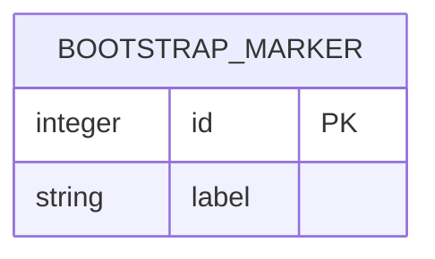

# Data Model: Work Frontier

The current persistent application schema is only a bootstrap marker table. PostgreSQL exists to certify migration behavior; no product-domain entities have been implemented.

## BootstrapMarker

**Owned by:** [Infrastructure Smoke](modules/infrastructure-smoke.md)

- Table: `bootstrap_markers`
- Fields: `id` primary key; `label`
- Source: `infra/alembic/versions/0001_bootstrap_marker.py:21`
- Purpose: minimal persistent object used to prove Alembic upgrade/downgrade and rollback behavior.

Evidence records are persisted as files/artifacts rather than relational rows in the current implementation.
