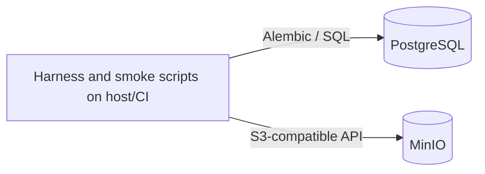

# Deployment: Work Frontier

The repository contains a local Docker Compose topology for verification infrastructure only. There is no application API, worker, scheduler, or frontend container.

## Services

| Service | Module(s) | Ports | Depends on | File |
| --- | --- | --- | --- | --- |
| `postgres` | `infrastructure-smoke` | `5432:5432` | — | [infrastructure-smoke.md](modules/infrastructure-smoke.md) |
| `minio` | `infrastructure-smoke` | `9000:9000`, `9001:9001` | — | [infrastructure-smoke.md](modules/infrastructure-smoke.md) |

## Runtime boundary

The executable Python/Node checks run on the host or in GitHub Actions and connect to these containers. The target architecture’s API, workers, event consumers and control-room UI are not deployed by the current Compose file.
