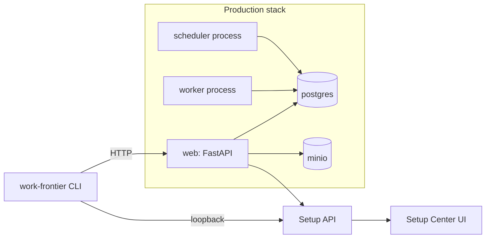

# Deployment: Work Frontier

## Services

| Service | Module(s) | Ports | Depends on | File |
| --- | --- | --- | --- | --- |
| `web` (FastAPI) | `control-plane-api`, `platform-persistence`, `application-layer`, `domain-layer` | `8000:8000` | postgres, minio | [control-plane-api.md](modules/control-plane-api.md) |
| `setup` (ephemeral FastAPI) | `control-plane-api`, `setup-application`, `platform-setup` | random loopback | -- | [control-plane-cli.md](modules/control-plane-cli.md) |
| `worker` | `process-interfaces`, `platform-persistence` | -- | postgres | [process-interfaces.md](modules/process-interfaces.md) |
| `scheduler` | `process-interfaces` | -- | postgres | [process-interfaces.md](modules/process-interfaces.md) |
| `postgres` | -- | `5432:5432` | -- | infra/compose/compose.production.yaml |
| `minio` | -- | `9000:9000`, `9001:9001` | -- | infra/compose/compose.production.yaml |

## Docker

- **Image:** built from `infra/docker/Dockerfile` using `uv` for Python dependency management.
- **Production Compose:** `infra/compose/compose.production.yaml` defines the full stack.

## Kubernetes

- **Manifest:** `infra/kubernetes/work-frontier.yaml` defines Deployment, Service, ConfigMap, and Secrets.
- **Observability:** Prometheus scrape targets at `infra/observability/prometheus.yml`; alerts at `infra/observability/alerts.yml`.

---

_Traced from actual Docker, Compose, and Kubernetes manifests on 2026-07-14._
