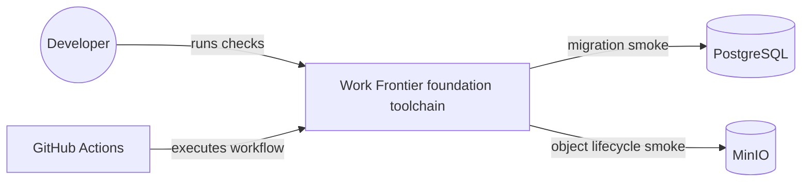
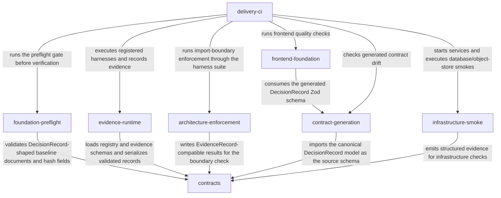
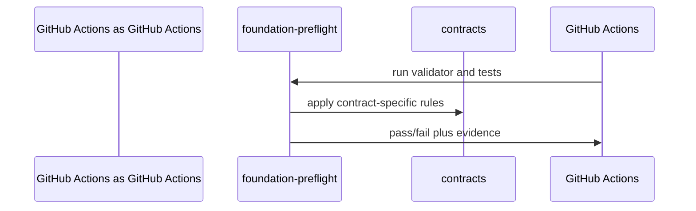
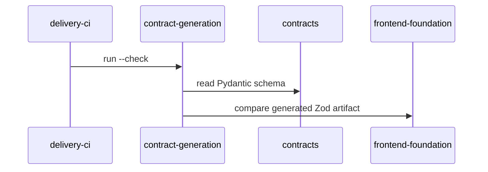
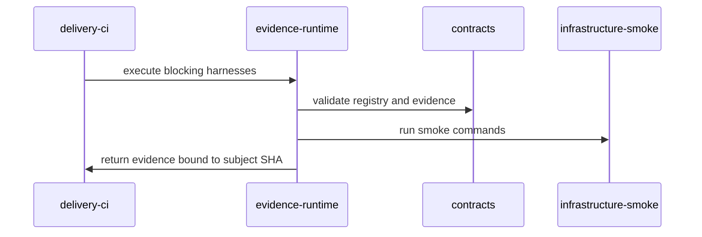

# System Diagram: Work Frontier

## System context

## Module dependency graph

Modules: [foundation-preflight](modules/foundation-preflight.md) · [contracts](modules/contracts.md) · [evidence-runtime](modules/evidence-runtime.md) · [architecture-enforcement](modules/architecture-enforcement.md) · [contract-generation](modules/contract-generation.md) · [infrastructure-smoke](modules/infrastructure-smoke.md) · [frontend-foundation](modules/frontend-foundation.md) · [delivery-ci](modules/delivery-ci.md)

## Key flows

### Foundation preflight gate

### Contract generation and drift check

### Harness evidence lifecycle

