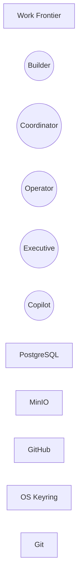

# System Diagram: Work Frontier

## System context

## Module dependency graph

```mermaid
graph TD
foundation-preflight["Foundation Preflight"]
contracts["Canonical Contracts"]
evidence-runtime["Evidence Runtime"]
architecture-enforcement["Architecture Enforcement"]
contract-generation["Contract Generation"]
infrastructure-smoke["Infrastructure Smoke"]
frontend-foundation["Frontend Foundation"]
delivery-ci["Delivery and CI"]
bootstrap-root["Bootstrap and Composition Root"]
control-plane-api["Control Plane API"]
control-plane-cli["Control Plane CLI"]
setup-application["Setup Application"]
platform-setup["Platform Setup"]
platform-operations["Platform Operations"]
platform-security["Platform Security"]
platform-secrets["Platform Secrets"]
platform-configuration["Platform Configuration"]
platform-persistence["Platform Persistence"]
application-layer["Application Layer"]
domain-layer["Domain Layer"]
process-interfaces["Process Interfaces"]
deployment-infrastructure["Deployment Infrastructure"]
foundation-preflight --> contracts
evidence-runtime --> contracts
architecture-enforcement --> contracts
contract-generation --> contracts
infrastructure-smoke --> contracts
infrastructure-smoke --> contract-generation
frontend-foundation --> contract-generation
delivery-ci --> foundation-preflight
delivery-ci --> contract-generation
delivery-ci --> architecture-enforcement
delivery-ci --> evidence-runtime
delivery-ci --> infrastructure-smoke
delivery-ci --> frontend-foundation
control-plane-cli --> contracts
control-plane-cli --> control-plane-api
control-plane-cli --> bootstrap-root
control-plane-api --> contracts
control-plane-api --> setup-application
setup-application --> contracts
setup-application --> application-layer
platform-setup --> contracts
platform-secrets --> contracts
platform-configuration --> contracts
bootstrap-root --> contracts
application-layer --> contracts
process-interfaces --> control-plane-api
deployment-infrastructure --> control-plane-api
```

Modules: [Foundation Preflight](modules/foundation-preflight.md) · [Canonical Contracts](modules/contracts.md) · [Evidence Runtime](modules/evidence-runtime.md) · [Architecture Enforcement](modules/architecture-enforcement.md) · [Contract Generation](modules/contract-generation.md) · [Infrastructure Smoke](modules/infrastructure-smoke.md) · [Frontend Foundation](modules/frontend-foundation.md) · [Delivery and CI](modules/delivery-ci.md) · [Bootstrap and Composition Root](modules/bootstrap-root.md) · [Control Plane API](modules/control-plane-api.md) · [Control Plane CLI](modules/control-plane-cli.md) · [Setup Application](modules/setup-application.md) · [Platform Setup](modules/platform-setup.md) · [Platform Operations](modules/platform-operations.md) · [Platform Security](modules/platform-security.md) · [Platform Secrets](modules/platform-secrets.md) · [Platform Configuration](modules/platform-configuration.md) · [Platform Persistence](modules/platform-persistence.md) · [Application Layer](modules/application-layer.md) · [Domain Layer](modules/domain-layer.md) · [Process Interfaces](modules/process-interfaces.md) · [Deployment Infrastructure](modules/deployment-infrastructure.md)
