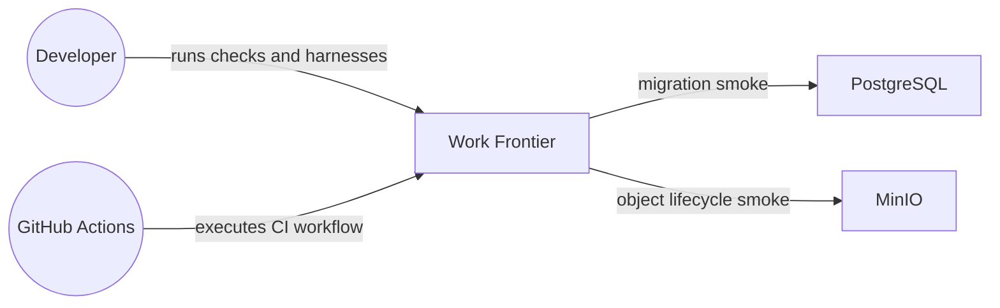
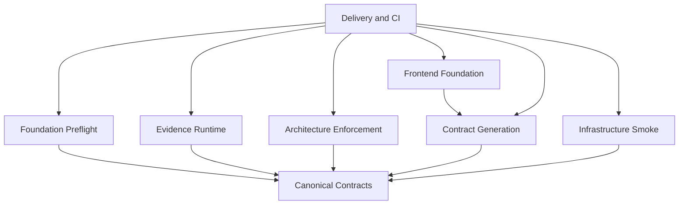
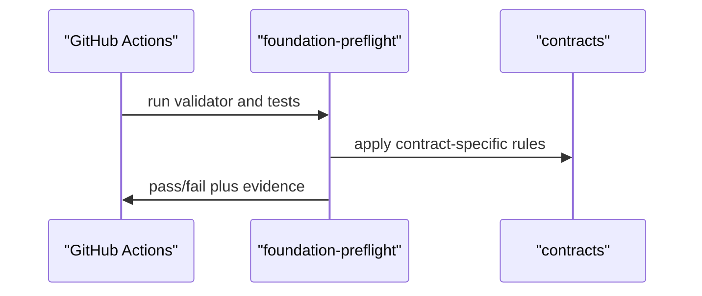
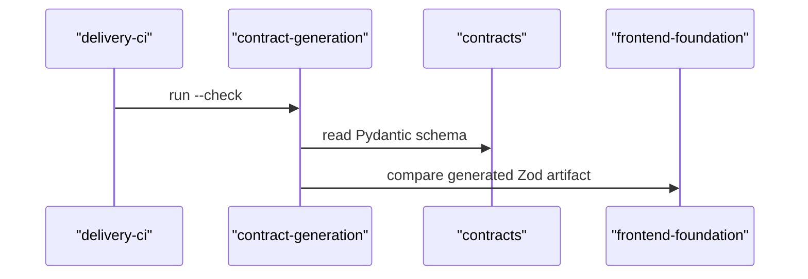
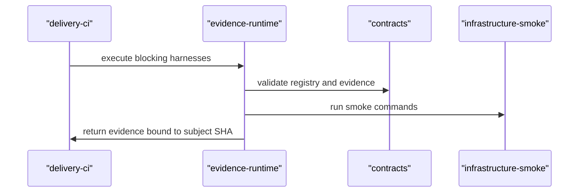

# System Diagram: Work Frontier

## System context

## Module dependency graph

Modules: [Foundation Preflight](modules/foundation-preflight.md) · [Canonical Contracts](modules/contracts.md) · [Evidence Runtime](modules/evidence-runtime.md) · [Architecture Enforcement](modules/architecture-enforcement.md) · [Contract Generation](modules/contract-generation.md) · [Infrastructure Smoke](modules/infrastructure-smoke.md) · [Frontend Foundation](modules/frontend-foundation.md) · [Delivery and CI](modules/delivery-ci.md)

## Key flows

### Foundation preflight gate

### Contract generation and drift check

### Harness evidence lifecycle

