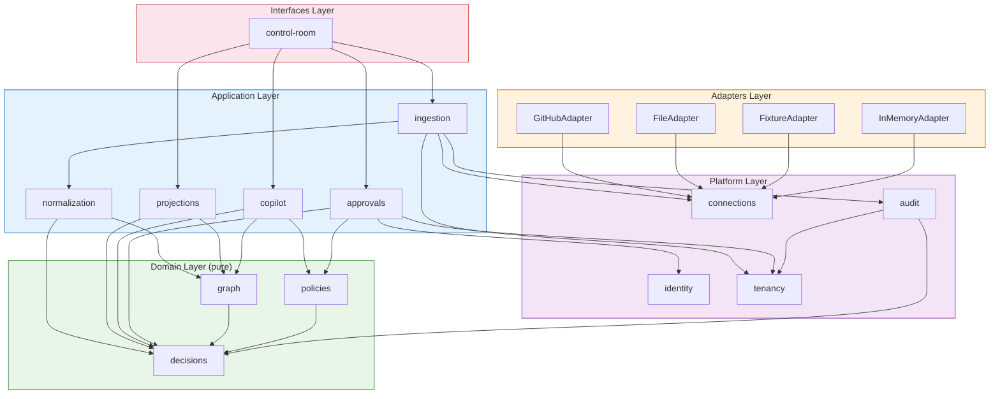
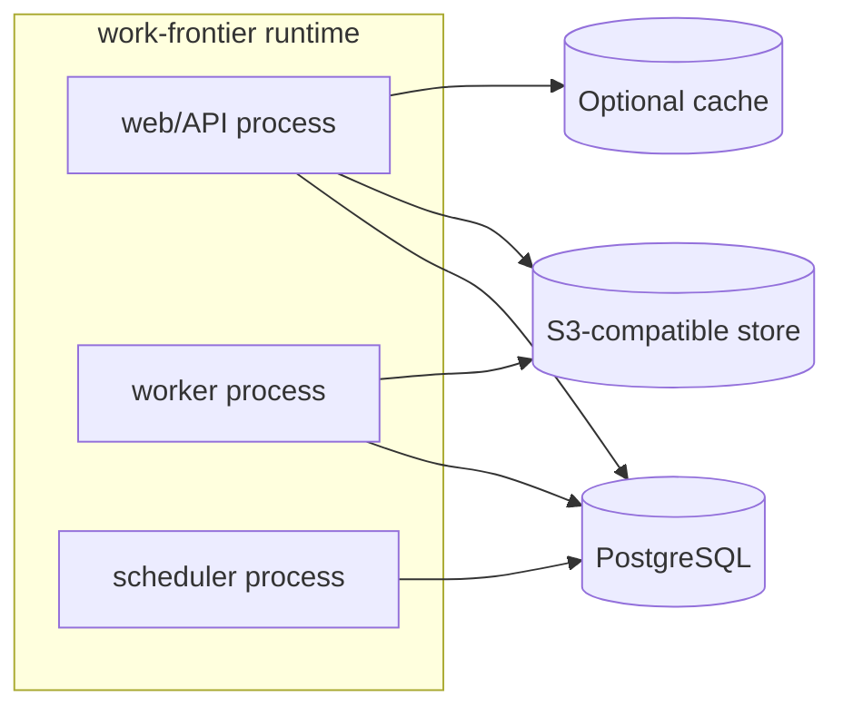
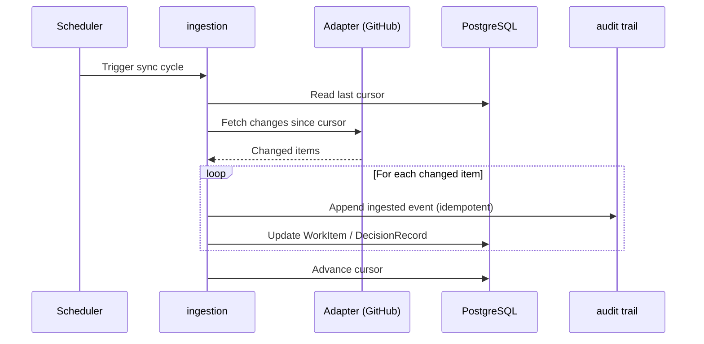

# Work Frontier — Architecture

## 1. What Work Frontier Is

Work Frontier is a **standalone dependency-aware readiness control plane**. It
ingests work items from external trackers, normalizes them into a dependency
graph, computes readiness and ranking, and surfaces the single recommended next
task. It is not coupled to any consumer; it has no knowledge of oh-my-class or
any other system that queries it.

Work Frontier is extracted as its own repository. GitHub issue #539 is a
reference fixture for development, not an architectural dependency. Work
Frontier imports nothing from any consumer repository.

---

## 2. Modular Monolith, Not Microservices

Work Frontier is a single deployable package. Its internal structure is a
**deep modular monolith**: separate domain modules behind clean seams, shipped
together, with forbidden import edges that prevent circular dependencies and
keep extraction possible.

Microservices are off the table. The seam discipline (section 3) keeps the
door open without paying the cost. See [ADR-003](../decisions/ADR-003-modular-monolith.md).

---

## 3. Module Taxonomy

Work Frontier's modules are organized in Domain, Platform, Application, and
Interfaces layers plus concrete adapters. ADR-006 is the canonical taxonomy and
port-ownership decision. The layers enforce a strict dependency direction.

### 3.1 The Thirteen Modules

| Module | Layer | Responsibility |
|--------|-------|---------------|
| `identity` | Platform | Actor/session identity and authentication context |
| `tenancy` | Platform | Workspace isolation, tenant configuration, scoped data access |
| `connections` | Platform | Connection registry, credential lifecycle, adapter binding |
| `graph` | Domain | Dependency graph construction, topological sort, cycle detection |
| `policies` | Domain | Readiness rules, blocking logic, priority calculation, configurable policy engine |
| `decisions` | Domain | DecisionRecord (core entity), lifecycle states, state machines, **deterministic frontier and ranking** |
| `ingestion` | Application | Pulls raw data from adapters, drives sync cycles, cursor management |
| `normalization` | Application | Maps tracker-native types to domain types, field extraction |
| `projections` | Application | Current-state views, safe auto-projections, authoritative mutation gating |
| `approvals` | Application | Gated mutations, approval workflows, human-in-the-loop checkpoints |
| `copilot` | Application | Explanations, proposals, recommendation context (not ranking) |
| `audit` | Platform | Tamper-evident audit/evidence recording, durable inbox, outbox, queue implementation |
| `control-room` | Interfaces | REST/OpenAPI surface, CLI surface, health endpoints |

### 3.2 Layer Diagram



### 3.3 Forbidden Import Edges

```
domain/       ──X──>  platform/ | application/ | adapters/ | interfaces/
platform/     ──X──>  application/ except application.ports
application/  ──X──>  platform/ implementations | adapters/ | interfaces/
adapters/     ──X──>  domain/ | application/ except application.ports | interfaces/
interfaces/   ──X──>  domain/ | platform/ | adapters/
```

Application owns the outbound port interfaces used by its use cases in the
public `application.ports` package. Platform and Adapters may import only those
port contracts to implement them; neither may import Application use cases or
internals. Domain exposes only pure types/functions and never owns a transport,
persistence, or external-service port. Interfaces call Application inbound use
cases. The composition root wires Platform/Adapter implementations into the
Application; Application never imports a concrete implementation.

### 3.4 Module Roles: Domain vs Application

Domain modules contain pure business rules. No I/O, no infrastructure
dependencies. Platform modules own durable technical capabilities. Application
modules orchestrate Domain and Platform interfaces for use cases.

`audit` sits in Platform because it records durable evidence, maintains
tamper-evident chains, and implements inbox/outbox/queue capabilities. It is
not a pure domain concept.

`copilot` sits in the Application layer because it composes domain queries
(readiness, ranking, dependency context) into explanation payloads and
mutation proposals. It does **not** own ranking or frontier computation.
Those are deterministic domain computations owned by `decisions`.

---

## 4. Module Contracts and Ownership

Every module has a single owning directory. The owner defines the public
interface, invariants, and failure behavior.

### 4.1 Key Invariants

| Module | Key Invariant | Failure Mode | Recovery |
|--------|--------------|--------------|----------|
| `decisions` | Reproducible envelope identifies exact snapshot/graph/policy/pipeline/engine inputs; owns frontier/ranking | Replay hash mismatch | Halt authoritative projection, emit integrity AttentionItem |
| `audit` | Per-workspace canonical envelope/payload hash chain; entries immutable within retention | Checksum/anchor mismatch | Halt segment writes, alert, manual review |
| `graph` | Typed validation detects containment cycles and dependency SCCs, then isolates invalid components | Cycle detected | Localized fail-closed; unaffected components continue |
| `policies` | Policy evaluation is pure; same input yields same readiness | Stale policy config | Re-evaluate; reads are side-effect-free |
| `projections` | Every computed cache names `derived_from_decision_id`; authoritative mutations require approval | Projection derivation drift | Rebuild atomically from identified source snapshot |
| `approvals` | No authoritative mutation lands without an approval record | Unauthorized write | Reject, audit event, alert |
| `ingestion` | Inbox/snapshot/decision/projection/audit/outbox commit atomically; replaying a source revision produces identical state | Partial sync | Retry claimed delivery; cursor advances only with atomic commit |
| `connections` | Credentials are never stored in the audit trail | Credential leak | Immediate rotation, audit alert |
| `identity` | Machine and user identities are never confused | Impersonation | Reject, audit event |
| `tenancy` | Every workspace-owned table uses forced RLS and scoped namespaces | Cross-tenant leak | Fail closed; alert and preserve forensic event |
| `copilot` | Explanations and proposals never become authority without deterministic validation and approval | Provider failure or unsafe output | Disable copilot path; deterministic decisions remain available |
| `normalization` | Tracker-native types map deterministically to domain types | Mapping drift | Re-evaluate with current profile |

### 4.2 Adapters

Adapters satisfy Application-owned outbound interfaces and use Platform
capabilities for scoped persistence, credentials, and durable delivery. An
adapter owns tracker transport/error translation; Platform owns persistence.

| Adapter | Role | Certification |
|---------|------|--------------|
| `GitHubAdapter` | Production tracker adapter | Level 3 (see [GITHUB.md](../integrations/GITHUB.md) section 4) |
| `FileAdapter` | Harness adapter for deterministic tests | Level 1 |
| `FixtureAdapter` | Harness adapter for snapshot tests | Level 1 |
| `InMemoryAdapter` | Harness adapter for unit tests | Level 0 |

GitHub is the only production tracker. File, Fixture, and InMemory adapters
exist solely to support deterministic test harnesses. See
[GITHUB.md](../integrations/GITHUB.md) section 4 for adapter certification.

### 4.3 Workspace-Scoped Persistence

Every query, write, object key, job, inbox delivery, cache key, audit segment,
and idempotency key is scoped to `workspace_id`; `tenant_id` remains a required
parent scope for administration and partitioning. The Interfaces layer sets
workspace context transaction-locally from the authenticated session. PostgreSQL
RLS with `FORCE ROW LEVEL SECURITY` is mandatory on every workspace-owned
production table, and the application role must not have `BYPASSRLS`.
Application query predicates are required defense in depth, not an alternative
to RLS. Adapters that cannot propagate workspace scope fail closed.

### 4.4 Cross-Language Contract Generation

Work Frontier generates deterministic JSON Schema and TypeScript Zod schemas
from canonical Pydantic models. This ensures backend validation, API
documentation, and frontend validation remain synchronized without manual
duplication.

**Generation flow:**

```
Pydantic models (Python)
    ↓ Pydantic.model_json_schema()
JSON Schema (contracts/generated/*.schema.json)
    ↓ x-to-zod (scripts/generate_zod_from_schema.mjs)
Zod schemas (frontend/src/contracts/*.generated.ts)
```

**Source of truth:** Pydantic models in `backend/src/work_frontier/contracts/`.
All downstream artifacts are generated, never hand-edited.

**Generation script:** `scripts/generate_contracts.py` orchestrates both JSON
Schema generation (via Pydantic's built-in serializer) and Zod generation (via
the x-to-zod library). The script writes deterministic artifacts with sorted
keys, normalized formatting, and stable constraint representations.

**Validation:** `make check-contracts` runs `generate_contracts.py --check` to
verify checked-in artifacts match the current Pydantic models. This gate runs
in CI and pre-commit hooks. Drift between Pydantic and generated artifacts is a
build failure.

**Why x-to-zod:** The initial hand-coded Zod schemas drifted from Pydantic
models (P0-3 false positive). Automated generation eliminates drift and ensures
JSON Schema constraints (minLength, minProperties, pattern, etc.) map correctly
to Zod refinements. The x-to-zod transformation is deterministic and preserves
all JSON Schema validation semantics.

**Constraint propagation examples:**

- Pydantic `Field(min_length=1)` → JSON Schema `"minLength": 1` → Zod `.min(1)`
- Pydantic `Field(min_length=64, max_length=64)` → JSON Schema `"minLength": 64, "maxLength": 64` → Zod `.min(64).max(64)`
- Pydantic model with `Dict[str, str]` and `Field(..., min_length=1)` on dict → JSON Schema `"type": "object", "minProperties": 1` → Zod `.record(z.string(), z.string()).refine(...)`

**Regeneration:**

```sh
make generate-contracts
```

This writes updated JSON Schema and Zod files. Commit them when Pydantic models
change. The generated files are checked in and versioned alongside source code.

---

## 5. Process Topology

Work Frontier runs as **three runtime processes**:



### 5.1 web/API Process

FastAPI-based. Serves the REST API, OpenAPI spec, and health endpoints.
Runs in uvicorn with a configurable worker count. `GET /healthz` returns
liveness and readiness separately.

### 5.2 worker Process

Consumes jobs from the durable queue (section 7). Executes ingestion cycles,
normalization, projection updates, and reconciliation. Coordinates through
PostgreSQL; no in-process message passing with the web/API process.

### 5.3 scheduler Process

Drives time-based triggers: periodic sync, reconciliation sweeps, cache
invalidation, stale-job detection. Enqueues jobs into the durable queue.
Does not execute them.

### 5.4 Why Three Processes

Separating them allows independent scaling and failure isolation. A slow
ingestion cycle cannot block API responses. A burst of webhooks cannot starve
scheduled reconciliation.

---

## 6. Persistence Model

Work Frontier uses **PostgreSQL** as the authoritative store for all operational
state. An **append-only audit trail** records every event for traceability.
An **S3-compatible store** holds bulky evidence artifacts. An **optional cache**
accelerates reads.

This is **not** event sourcing. PostgreSQL current tables are the authoritative
source of truth for operational state. The audit trail is a permanent,
append-only record of what happened, but you cannot and must not attempt to
rebuild current state by replaying it.

### 6.1 PostgreSQL: Authoritative Current State

PostgreSQL holds the operational truth. All reads and writes go through these
tables.

**Core entity tables:**

- `work_items` — authoritative tracker/user/policy fields and metadata. It does
  **not** own mutable readiness or ranking truth; immutable source-item versions
  are stored alongside for diff tracking.
- `decision_records` — immutable, context-complete decisions produced from a
  specific normalized snapshot and policy bundle. They retain ranking
  rationale, gate outcomes, authority status, and recommendation context.
- `connections` — Tracker connection config, credential references, active
  ingestion profile.
- `tenants` — Tenant registry and configuration.

**Infrastructure tables:**

- `gate_evaluations` — Per-item gate evaluation results and evidence.
- `attempts` — Sync and processing attempts with timing and outcome.
- `approvals` — Approval records for gated mutations.
- `overrides` — Scoped, time-bounded human overrides with provenance.
- `audit_events` — Append-only audit trail entries (see section 6.2).
- `source_item_versions` — Immutable snapshots of what the tracker reported
  at each sync. Used for diff and drift detection.
- `normalized_snapshots` — Canonical normalized input bundles with content hash,
  graph revision, source-revision set, and ingestion-profile version.
- `current_projections` — Read models that cache computed fields only with a
  non-null `derived_from_decision_id`, source snapshot hash, and graph/policy
  revisions. A projection with a missing or stale derivation is not authoritative.
- `transactional_outbox` — Committed external-write intents with idempotency key,
  projection fingerprint, causation, and correlation IDs.
- `webhook_inbox` — Signed raw delivery metadata/payload hashes and processing
  state, unique by workspace plus delivery ID.
- `job_queue` — Durable queue for background work (see section 7).

### 6.2 Audit Trail (Append-Only and Tamper-Evident)

The audit trail is a permanent, immutable record of every event Work Frontier
has observed or produced. It is the traceability layer. It is **not** the
source of truth for current state.

Each entry carries:

- `segment_id` / `seq` — Workspace-scoped append-only segment and monotonic
  sequence number. A segment is never shared across workspaces.
- `tenant_id` / `workspace_id` — Required administrative and data scope.
- `item_id` — Reference to the affected WorkItem, if applicable.
- `event_id` — Idempotency key (UUID). Unique per tenant.
- `event_type` — What happened: `ingested`, `normalized`, `state_changed`,
  `approved`, `rejected`, `override_applied`, `gate_evaluated`, etc.
- `actor` — Who did it: `machine:github`, `user:<id>`, `system:scheduler`.
- `payload` — JSONB event details.
- `causation_id` / `correlation_id` — The direct triggering event and end-to-end
  operation identity.
- `payload_hash` — SHA-256 of canonical payload JSON.
- `checksum` — SHA-256 chain for tamper detection.
- `created_at` — Timestamp.

**Checksum chain**: Canonical JSON uses UTF-8, sorted object keys, normalized
timestamps, and no insignificant whitespace. Each entry's checksum is:

```
SHA256(previous_checksum || canonical_event_envelope || payload_hash)
```

`canonical_event_envelope` includes segment/sequence, tenant/workspace, event
ID/type, actor, subject, causation/correlation IDs, and timestamp. The first
entry uses a 64-character zero genesis hash. This detects payload, actor,
timestamp, ordering, and envelope tampering within a segment.

The chain alone does not defend against a privileged actor rewriting the entire
database segment. Production threat models that include that actor require
periodic externally signed segment anchors or WORM object-store retention; the
anchor reference is recorded in the next segment.

The audit trail is append-only within its governed retention lifetime: entries
are never updated in place or selectively removed. Retention expiry and legal
deletion run as auditable, policy-governed segment purges. Current state lives
in the authoritative PostgreSQL tables above, not in the audit trail.

### 6.3 S3-Compatible Evidence Storage

Large evidence artifacts (full issue bodies, large comment threads, binary
attachments) are stored in an S3-compatible object store. Objects are
referenced by content hash. The audit trail references objects by key; the
objects themselves are never mutated.

```
evidence://{tenant_id}/{item_id}/{event_id}/{artifact_name}
```

Artifacts are stored with their SHA-256 hash as metadata for integrity
verification on retrieval.

### 6.4 Optional Cache

A read-through cache (Redis, Memcached, or in-process) accelerates hot-path
reads: frontier queries, projection lookups, and graph traversals. The cache
is always derived from PostgreSQL; it is never the source of truth.

---

## 7. Durable Queue

Background work is tracked through a durable queue backed by PostgreSQL.

The queue table stores:

- `id` — Job identifier.
- `tenant_id` / `workspace_id` — Required scope.
- `job_type` — What kind of work: `sync`, `normalize`, `reconcile`, etc.
- `state` — `pending`, `claimed`, `retry_scheduled`, `completed`, `dead_letter`.
- `idempotency_key` — Derived from canonical job inputs. Unique per workspace.
- `payload` — JSONB job parameters.
- `result` — JSONB outcome on completion.
- `lease_owner` / `lease_expires_at` / `heartbeat_at` — Compare-and-swap claim
  ownership and liveness.
- `attempts` / `max_attempts` / `next_attempt_at` — Retry and backoff tracking.
- `dead_letter_reason` / `replay_of` — Poison-message quarantine and controlled replay.
- `created_at`, `claimed_at`, `completed_at` — Lifecycle timestamps.

### 7.1 Job Lifecycle

1. **Enqueue**: Application transaction writes a `pending` job with a canonical
   idempotency key and workspace scope.
2. **Claim**: A worker selects an eligible job using `FOR UPDATE SKIP LOCKED`,
   fair tenant/workspace ordering, and a compare-and-swap update that assigns
   `lease_owner` and `lease_expires_at`.
3. **Execute**: The worker heartbeats only while it owns the lease.
4. **Complete/Retry/Quarantine**: Ownership-checked completion writes `completed`;
   retryable failure schedules exponential backoff with jitter; exhausted or
   non-retryable jobs move to `dead_letter` and require auditable replay.

### 7.2 Stale Job Recovery

If a claim lease expires, the scheduler can reclaim only through a
compare-and-swap transition. It increments attempts and schedules retry; an
exhausted job moves to `dead_letter`, never silently disappears. The timeout,
backoff, fairness quantum, and maximum attempts are versioned Platform policy.

---

## 8. Sync / Reconciliation

Work Frontier keeps bidirectional sync between its PostgreSQL state and
external trackers. The `ingestion` module drives this process.

### 8.1 Incremental Sync Consistency Protocol

The internal state machine is:

```
received → verified → persisted → claimed → refetched → normalized
        → solved → projected → completed
                         ↘ retry_scheduled → dead_letter
```

`received` accepts no authority claim. `verified` validates signature/scope.
`persisted` durably records the inbox delivery before acknowledgment.
`claimed` has a lease owner. `refetched` is the authoritative tracker read.

For one source revision, the following commit in **one PostgreSQL transaction**:

1. normalized snapshot and its canonical hash/revision set;
2. immutable DecisionRecord set;
3. current projections with `derived_from_decision_id`;
4. audit event and checksum entry;
5. transactional outbox intents; and
6. cursor/source-version advancement.

Any failure rolls back the entire internal commit. After commit, an outbox worker
performs external GitHub writes using a workspace-scoped idempotency key and
projection fingerprint. The tracker response re-enters the inbound protocol;
external write success never substitutes for local atomicity.

### 8.2 Reconciliation

Reconciliation handles drift between local state and tracker state. The
scheduler process triggers it periodically.

- **Drift detection**: Items where current-state revision disagrees with the
  tracker's revision. Reconciliation applies the configured precedence ladder
  and emits a conflict when sources disagree; it never assumes one source wins
  every field.
- **Orphan detection**: Items in PostgreSQL that no longer exist in the tracker.
  Orphans are flagged, not deleted.
- **Gap filling**: Missing transitions from sync outages. The reconciler
  backfills from the tracker's event log.



### 8.3 Idempotency and Fencing

- **Idempotency**: Inbox, source revision, job, outbox, and audit identities are
  unique within `workspace_id`; one layer's dedup key is never reused as another
  layer's fencing token.
- **Fencing**: Source versions, graph revision, policy-bundle hash, projection
  fingerprint, and row version are checked by compare-and-swap. Timestamp order
  is never used as a stale-write decision.

---

## 9. Public API Surface

Work Frontier exposes a **REST/OpenAPI** surface and a **CLI**. Both are
production interfaces with full parity.

### 9.1 REST / OpenAPI

The REST API is documented by OpenAPI 3.1, generated from the FastAPI app and
served at `GET /openapi.json`.

| Method | Resource | Description |
|--------|----------|-------------|
| `GET` | `/healthz` | Liveness and readiness probe |
| `GET` | `/programs` | List programs (tenant-scoped) |
| `GET` | `/programs/{id}` | Get a single program with summary stats |
| `GET` | `/work-items` | List work items (filtered by program, state, readiness) |
| `GET` | `/work-items/{id}` | Get a single work item with full context |
| `GET` | `/frontier` | Query the latest persisted authoritative frontier and its DecisionRecord IDs |
| `POST` | `/work-items/{id}/revalidation` | Trigger revalidation of a specific item |
| `POST` | `/work-items/{id}/claim` | Claim a work item (lease acquisition) |
| `POST` | `/proposals` | Submit a mutation proposal for approval |
| `GET` | `/proposals` | List pending proposals |
| `POST` | `/proposals/{id}/approve` | Approve a proposal |
| `POST` | `/proposals/{id}/reject` | Reject a proposal |
| `GET` | `/connections` | List tracker connections |
| `GET` | `/audit` | Audit trail entries (paginated, tenant-scoped) |
| `POST` | `/sync` | Trigger an on-demand sync cycle |

The `/frontier` endpoint returns the latest persisted **computed safe output**.
It is the engine's recommendation, not a mutation. Viewing it does not change
state; explicit revalidation creates new immutable DecisionRecords.
See [recommended-next](../domain/recommended-next.md) for the full
specification.

### 9.2 CLI

The CLI provides the same operations as the REST API for scripting and
automation:

```
wf programs list --tenant <id>
wf work-items list --program <id> --state open
wf frontier next --tenant <id>
wf work-items claim --id <id>
wf proposals submit --type priority --item <id> --value high
wf proposals approve --id <id>
wf sync trigger --connection <id>
wf audit tail --tenant <id> --since <timestamp>
```

### 9.3 Extension Model

External consumers interact only through the REST API or CLI. They never
import Work Frontier's modules directly. The API surface is the integration
contract.

Two extension points exist:

1. **Declarative policy DSL**: Operators define readiness rules, blocking
   logic, and priority calculations in a declarative DSL. The `policies`
   module evaluates them. No code deployment required for policy changes.

2. **Isolated executable adapters**: New tracker adapters are isolated
   executables that communicate with the engine through the adapter port
   interface. They are loaded at runtime based on connection configuration.
   Each adapter runs in its own process boundary; a misbehaving adapter cannot
   crash the engine. See [GITHUB.md](../integrations/GITHUB.md) section 4 for
   adapter certification levels.

---

## 10. Capacity Envelope

Work Frontier operates within the **Standard** and **Large** capacity envelopes
defined in the [Performance Envelope](../quality/performance-envelope.md).
Deployment sizing is in [Deployment Profiles](../operations/deployment-profiles.md).

### Standard Envelope (default)

10,000 items, 50,000 edges, 100 repositories, 50 concurrent users.

### Large Envelope

100,000 items, 500,000 edges, 1,000 repositories, 200 concurrent users.
Requires explicit infrastructure sizing beyond defaults.

### Operational Limits

| Resource | Limit | Enforcement |
|----------|-------|-------------|
| Concurrent sync cycles | 1 per tenant | Durable queue serializes per tenant |
| Max evidence events per sync | 1,000 | Adapter paginates; ingestion halts and resumes next cycle |
| API request timeout | 30 seconds | uvicorn config |
| Worker job timeout | 5 minutes | Heartbeat detection (section 7.2) |
| GitHub API calls per sync | 5,000 (App token) | Adapter backs off on rate limit |
| PostgreSQL connection pool | Per-process configurable | SQLAlchemy pool |
| S3 object size | 50 MB | Adapter rejects larger artifacts |

Operational limits are enforced at the application layer without truncating
authoritative results. The performance envelope targets (latency, throughput,
resource usage) are in [performance-envelope.md](../quality/performance-envelope.md).

---

## 11. Self-Host and Hosted

Both deployment profiles share the same codebase and artifacts. The difference
is infrastructure management, not software.

- **Self-host (Compose)**: Supported standalone production profile with an
  explicitly single-node, non-HA capability statement. The Docker
  Compose setup runs one PostgreSQL instance with no replication. See
  [deployment-profiles.md](../operations/deployment-profiles.md) for sizing
  and capability matrix.
- **Hosted**: Managed deployment with HA, auto-scaling, automated backups,
  and warm DR.

Neither profile is a different build. Same container images, same database
schema, same API surface.

---

## 12. Standalone Extraction Boundary

Work Frontier is standalone by design. It has no runtime dependency on any
consumer.

### 12.1 Import Boundary

Nothing under `work-frontier/` may import from `packages/`, `services/`,
`apps/`, or `common/`. The reverse is permitted: consumers may depend on Work
Frontier.

### 12.2 Extraction Checklist

When extracting to a separate repository:

1. Move `work-frontier/` to its own repository.
2. Publish the OpenAPI spec as the integration contract.
3. Set up CI/CD for the standalone package.
4. Consumers switch from local import to package registry or git submodule.

---

## 13. Documents Not Duplicated Here

| Concern | Doc Location | Status |
|---------|-------------|--------|
| Domain vocabulary | [domain/work-item.md](../domain/work-item.md), [domain/terminology.md](../domain/terminology.md) | Written |
| DecisionRecord | [domain/decision-record.md](../domain/decision-record.md) | Written |
| Recommended next | [domain/recommended-next.md](../domain/recommended-next.md) | Written |
| Readiness and ranking | [domain/readiness-ranking.md](../domain/readiness-ranking.md) | Written |
| Authority statuses | [domain/authority-statuses.md](../domain/authority-statuses.md) | Written |
| Gates and evidence | [domain/gates-and-evidence.md](../domain/gates-and-evidence.md) | Written |
| Lifecycle and completion | [domain/lifecycle-and-completion.md](../domain/lifecycle-and-completion.md) | Written |
| GitHub adapter | [integrations/GITHUB.md](../integrations/GITHUB.md) | Written |
| Security model | [security/threat-model.md](../security/threat-model.md), [security/authorization.md](../security/authorization.md) | Written |
| Performance envelope | [quality/performance-envelope.md](../quality/performance-envelope.md) | Written |
| Deployment topology | [operations/deployment-profiles.md](../operations/deployment-profiles.md) | Written |
| ADRs | [decisions/ADR-index.md](../decisions/ADR-index.md) | Written |
| API reference | Generated OpenAPI at `/openapi.json` | Runtime |

---

> **Last updated**: 2026-07-12
> **Maintained by**: Core team.
