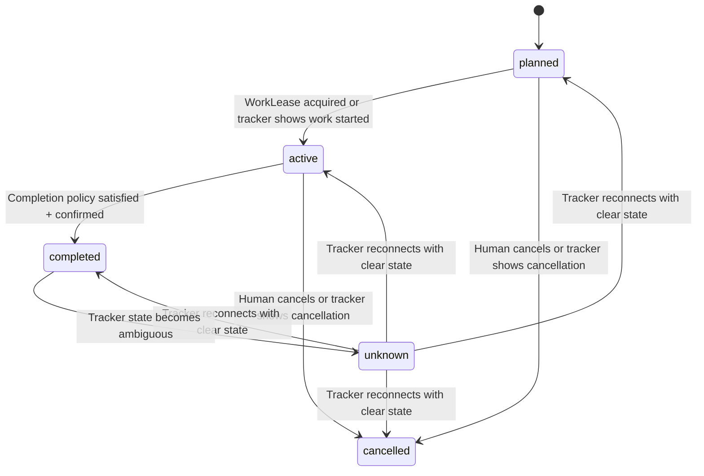
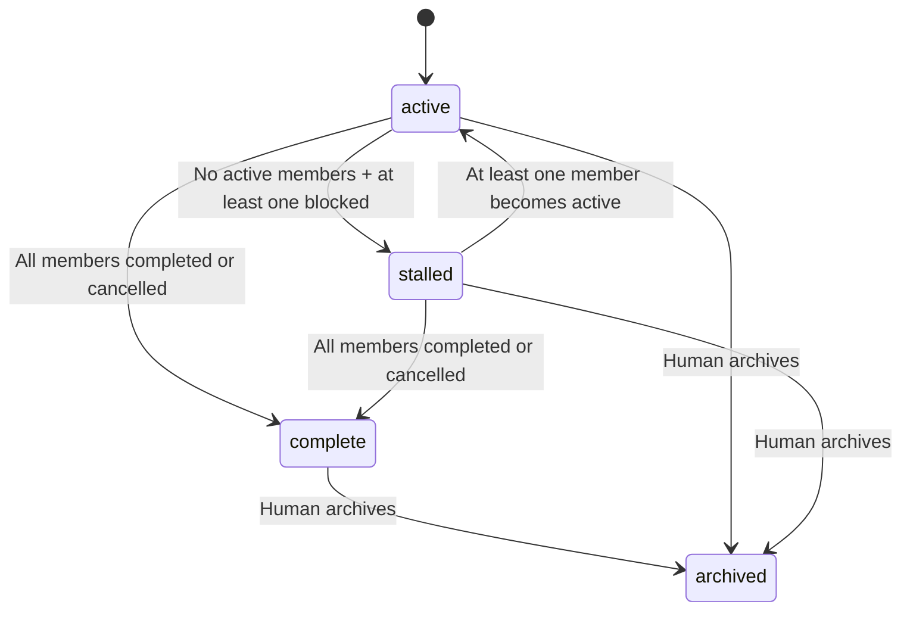
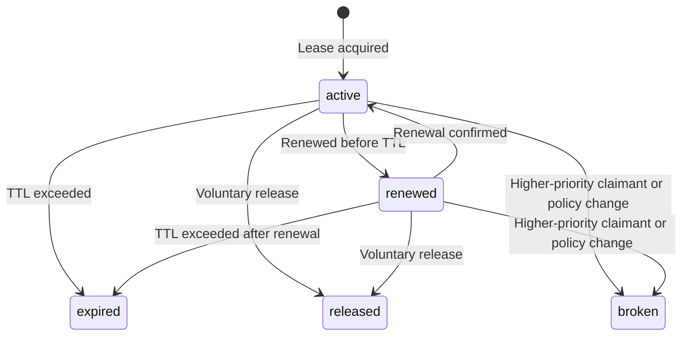
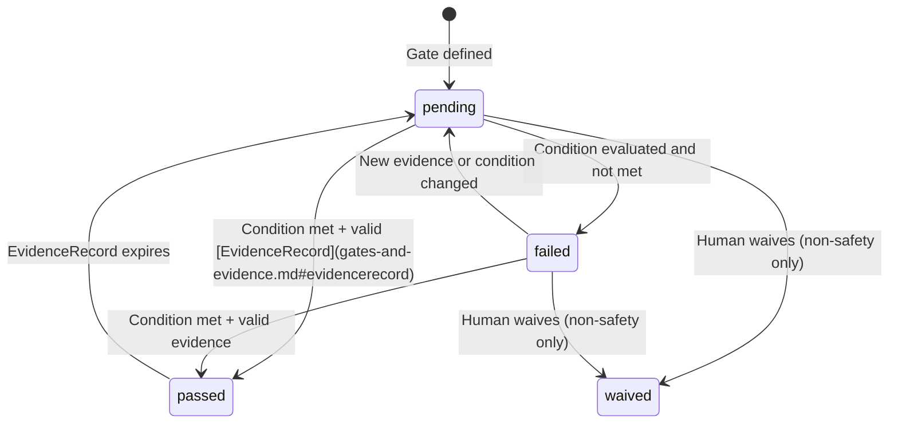
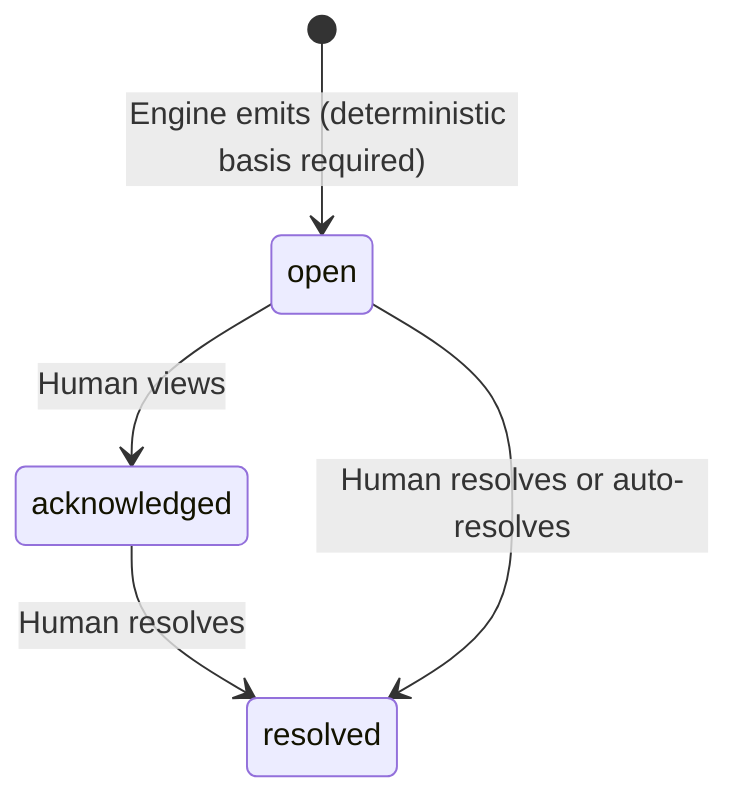
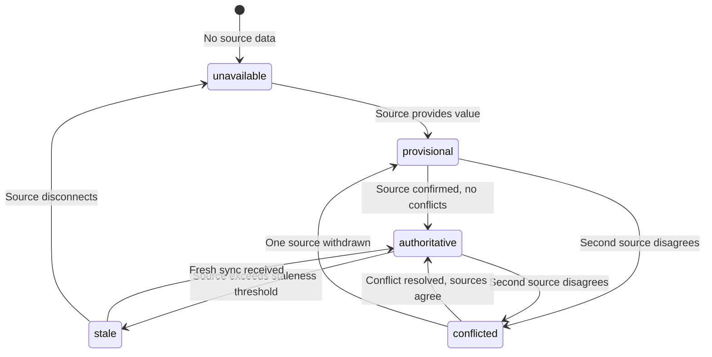

# State Machines

**WF-DOM-11**: Formal state machine definitions for all entities in Work Frontier. Every transition is deterministic, auditable, and constrained by linked domain docs.

## WorkItem Lifecycle

States: `planned`, `active`, `completed`, `cancelled`, `unknown`



### Transition Rules

| From | To | Trigger | Conditions |
|------|----|---------|-----------|
| `planned` | `active` | [WorkLease](work-lease.md) acquired or tracker sync | Entry gates pass and no active exclusive lease is held by another claimant. |
| `active` | `completed` | [Completion policy](lifecycle-and-completion.md#completion) satisfied | All Gates pass, EvidenceRecords accepted, human confirms. |
| `active` | `cancelled` | Human cancels or tracker sync | Explicit action. Subject to [safety constraints](authority-statuses.md#safety-override-constraints). |
| `planned` | `cancelled` | Human cancels or tracker sync | Explicit action. |
| `unknown` | any | Tracker reconnects | Tracker provides clear state via [TrackerConnection](tracker-connection.md). |
| `completed` | `unknown` | Tracker state ambiguous | Rare. Signals tracker drift. |

### Forbidden Transitions

- `completed` → `planned`, `completed` → `active`
- `cancelled` → `planned`, `cancelled` → `active`
- `planned` → `completed` (must go through `active`, except tracker sync showing direct completion)

## Program Lifecycle

States: `active`, `stalled`, `complete`, `archived`



### Rollup Logic

```
if all members in (completed, cancelled):
    status = complete
elif no members in active and any member blocked:
    status = stalled
else:
    status = active
```

Empty Program → `archived` + `capacity_action` [AttentionItem](attention-items.md).

## WorkLease Lifecycle

States: `active`, `renewed`, `expired`, `released`, `broken`



## Gate Lifecycle

States: `pending`, `passed`, `failed`, `waived`



### Forbidden Transitions

- `passed` → `failed`: Goes through `pending`.
- `waived` → anything: Waived is terminal.

## AttentionItem Lifecycle

States: `open`, `acknowledged`, `resolved`



Every AttentionItem must have a `deterministic_basis`. AI may suggest items but they are only emitted after deterministic validation.

### Severity

Severity is assigned at emission time based on [category and context](attention-items.md#categories). There is no age-based severity escalation. Severity can be reassessed if the underlying condition changes, driven by the deterministic basis, not by age.

## Authority Status Lifecycle

States: `authoritative`, `provisional`, `stale`, `conflicted`, `unavailable`



## Cross-Entity Interactions

| Event | Affected entities | Effect |
|-------|------------------|--------|
| WorkLease acquired on `planned` | WorkItem, WorkLease | `planned` → `active`. |
| WorkLease expires | WorkItem, WorkLease | Lease: `active` → `expired`. Lifecycle: `active` → `planned` (if no work logged). |
| Completion gate passes on `active` item | WorkItem, Gate | Gate: `pending`/`failed` → `passed`. If the completion policy is satisfied and required confirmation exists: `active` → `completed`. |
| `blocks` dependency completes | Downstream WorkItem | Readiness re-evaluates. |
| All Program members `completed` | Program | `active`/`stalled` → `complete`. |
| Safety Gate fails | WorkItem | `security_action` AttentionItem. An entry safety gate blocks readiness; later-phase safety gates block their corresponding outcomes. |
| User override on lifecycle | WorkItem | Lifecycle set to user's value, subject to [safety override constraints](authority-statuses.md#safety-override-constraints). [Precedence](authority-statuses.md#source-precedence): human override > configured policy > native tracker > structured metadata > parsed Markdown > inference. |

These interactions are deterministic. Given the same inputs, the engine produces the same transitions every cycle.
