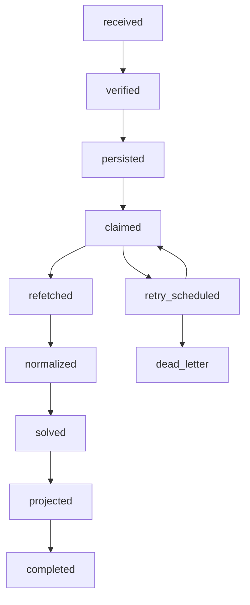
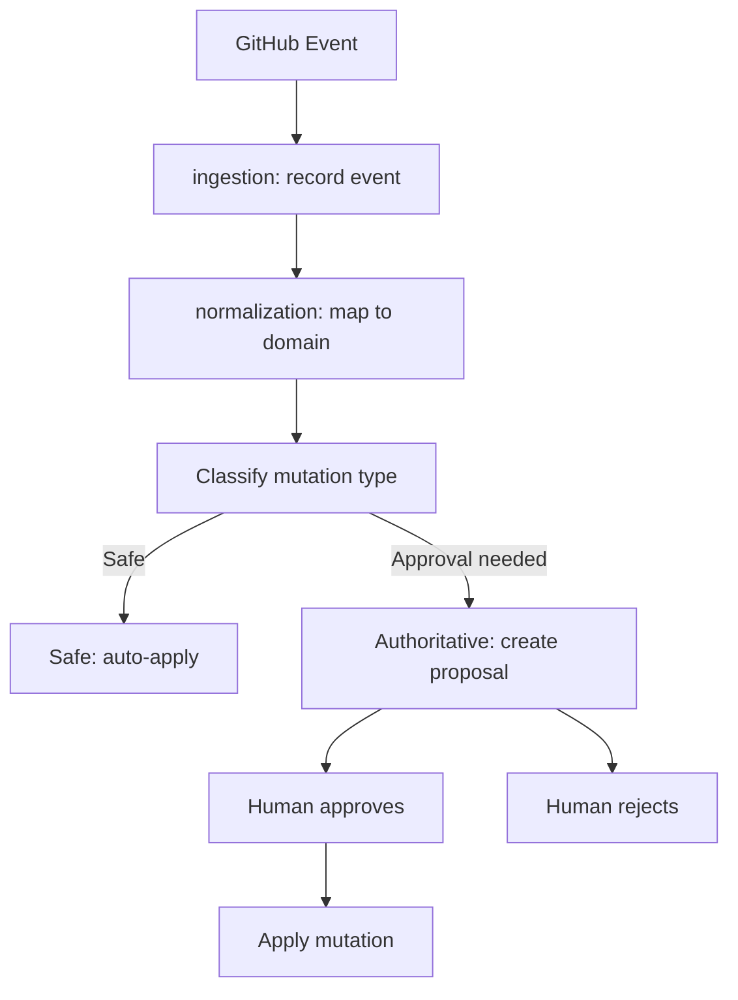

# Work Frontier — GitHub Integration

## 1. Scope

GitHub is the **only production tracker** for Work Frontier. This document
describes how Work Frontier authenticates to GitHub, ingests work items,
certifies adapters, owns projections, and runs controlled cutover during
profile upgrades.

File, Fixture, and InMemory adapters are harness adapters for deterministic
testing. They do not connect to any external service. The architecture
supports adding other trackers in the future, but none are in production
scope today.

---

## 2. Authentication: Machine Identity + User Identity

Work Frontier uses two distinct authentication mechanisms for GitHub. They
serve different purposes and must not be confused.

### 2.1 GitHub App (Machine Identity)

The GitHub App is the **primary production credential** for all automated
operations.

**Credential flow:**

```
Work Frontier (identity module)
    │
    ├── App ID + Private Key
    │       │
    │       ▼
    │   JWT signed with private key
    │       │
    │       ▼
    │   POST /app/installations/{id}/access_tokens
    │       │
    │       ▼
    │   Installation Access Token (short-lived, scoped to repos)
    │
    └── Used for: sync, normalization, ingestion, webhook handling,
                  projection writes (issues:write)
```

**Security rules:**

- The private key lives in an environment variable (`GH_APP_PRIVATE_KEY`),
  never in a file committed to the repository.
- Installation tokens are short-lived (1 hour default) and **not persisted**.
  The `connections` module refreshes them before expiry. Tokens exist only in
  memory for the duration of a request.
- The App is installed only on repositories that Work Frontier manages.
- Webhook secret (`GH_WEBHOOK_SECRET`) validates incoming events. Invalid
  signatures are rejected at the HTTP boundary.

**Permissions:**

| Permission | Reason |
|-----------|--------|
| `issues:write` | Write generated projections (labels, comments, milestone updates) back to GitHub |
| `pull_requests:read` | Ingest PR-linked dependency edges |
| `metadata:read` | Repository and organization metadata |

The `issues:write` permission is required because Work Frontier writes
computed projections back to GitHub as labels and comments, making the
readiness state visible on the tracker itself.

### 2.2 OAuth / OIDC (User Identity)

OAuth/OIDC is used when a **human** authorizes Work Frontier to act on their
behalf. This is the user identity path, distinct from the machine identity.

**Use cases:**

- Approval workflows where a human must sign off on authoritative mutations.
- Identity attribution in the audit trail (`user:<id>` actor prefix).
- OIDC token exchange for zero-trust environments.

**Flow:**

```
User → Work Frontier UI → GitHub OAuth authorize
                              │
                              ▼
                          Authorization code
                              │
                              ▼
              Work Frontier exchanges for access token
                              │
                              ▼
              User access token (short-lived, scoped to user's repos)
```

**Security rules:**

- OAuth/OIDC tokens are stored encrypted, never in the audit trail.
- OAuth/OIDC tokens are used only for user-initiated actions, never for sync
  or reconciliation.
- The `user:` actor prefix in audit trail events distinguishes user-identity
  actions from machine-identity actions (`machine:github`).

### 2.3 Identity Isolation

```
┌──────────────────────────────────────────────────┐
│              Identity Isolation Boundary           │
├─────────────────────┬────────────────────────────┤
│  GitHub App         │  OAuth / OIDC               │
│  (machine identity) │  (user identity)             │
├─────────────────────┼────────────────────────────┤
│  Sync cycles        │  Approval workflows          │
│  Reconciliation     │  User-initiated mutations     │
│  Webhook ingest     │  OIDC token exchange          │
│  Normalization      │  Identity attribution         │
│  Projection writes  │                               │
├─────────────────────┼────────────────────────────┤
│  Refreshed hourly   │  Expires / revocable          │
│  Not persisted      │  (user can revoke)            │
└─────────────────────┴────────────────────────────┘
```

---

## 3. Webhook Inbox

Work Frontier treats GitHub webhooks as a **durable signed inbox**. Every
incoming event follows a fenced state machine; internal state commits atomically
before any external projection write.

### 3.1 Webhook Pipeline



**Step by step:**

1. **Verify**: Validate `X-Hub-Signature-256` against `GH_WEBHOOK_SECRET`
   using HMAC-SHA256. Reject invalid signatures with `401 Unauthorized` at
   the HTTP boundary.

2. **Persist to durable inbox**: Write the raw webhook payload hash, delivery
   metadata, workspace scope, and state `persisted` to PostgreSQL immediately.
   This is the durable inbox. Even if processing fails later, the raw event is
   safe. The delivery is acknowledged only after this commit.

3. **Dedup and claim**: Use `X-GitHub-Delivery` with `workspace_id` as the inbox
   deduplication key. A worker claims persisted work with `FOR UPDATE SKIP
   LOCKED`, `lease_owner`, expiry, and compare-and-swap state transition. A
   replayed delivery acknowledges without duplicate processing.

4. **Authoritative refetch**: Do **not** trust the webhook payload as the
   final state. The adapter refetches the item from the GitHub API using the
   installation token. Webhooks can arrive out of order, be truncated, or
   carry stale data. The API response is the authoritative source.

5. **Normalize revision**: Map the refetched GitHub data to the domain model
   using the active ingestion profile. Track what changed relative to the
   previous version.

6. **Affected-region solve**: Re-evaluate only the graph region affected by
   this change. If issue #42's dependencies changed, re-evaluate #42 and
   everything it blocks. Do not re-solve the entire graph for a single item
   change.

7. **Atomic internal commit**: In one transaction append normalized snapshot,
   immutable DecisionRecord set, current projections naming
   `derived_from_decision_id`, audit event, outbox intent, and source cursor.
   Existing DecisionRecords are never updated in place. Any failure rolls back
   all these writes.

8. **External idempotent projection**: After commit, an outbox worker performs
   any GitHub write with a workspace-scoped idempotency key and projection
   fingerprint. GitHub responses return through inbound processing; no external
   success can create partial local state.

9. **Retry/dead letter**: Retryable processing failures receive scheduled
   backoff. Poison or exhausted deliveries enter auditable `dead_letter` state
   and require controlled replay.

### 3.2 Events Processed

| Event | Action |
|-------|--------|
| `issues.opened` | Ingest new item, create WorkItem + DecisionRecord |
| `issues.edited` | Refetch, normalize revision, affected-region solve |
| `issues.closed` | Refetch, normalize lifecycle transition |
| `issues.reopened` | Refetch, normalize lifecycle transition |
| `issues.assigned` | Refetch, update ownership fields |
| `issues.labeled` | Refetch, update labels via profile rules |
| `issues.unlabeled` | Refetch, update labels via profile rules |
| `pull_request.opened` | Ingest PR as WorkItem (if profile includes PRs) |
| `pull_request.closed` | Refetch, normalize lifecycle transition |
| `issue_comment.created` | Record in audit trail (metadata only) |

### 3.3 Webhook + Polling Coexistence

Webhooks provide near-real-time updates. Polling provides catch-up. Both
follow the same pipeline and write to the same PostgreSQL tables with
idempotency guarantees:

- Webhook events carry a `delivery_id` used as the dedup key.
- Poll results carry a `workspace_id + connection_id + item_id + source_revision`
  idempotency key. Webhooks and polls may have different inbox keys, so
  normalization also deduplicates by authoritative source revision before
  solving.

### 3.4 Webhook Security

- Every incoming request must have a valid `X-Hub-Signature-256` header.
- Invalid signatures are rejected with `401 Unauthorized` at the HTTP boundary.
- Replay protection uses the `X-GitHub-Delivery` UUID, durable deduplication,
  signature verification, installation scope, and authoritative refetch.
  Delivery age is not inferred from an untrusted payload timestamp.
- The durable inbox persists the raw payload before any processing, so failed
  events can be retried without asking GitHub to resend.

---

## 4. Adapter Certification

Not every adapter is production-ready. Work Frontier defines a certification
process that an adapter must pass before it's used in production.

### 4.1 Certification Levels

| Level | Name | Requirements | Use |
|-------|------|-------------|-----|
| 0 | `experimental` | Compiles, implements connection interface | Development only |
| 1 | `deterministic` | Passes fixture-based snapshot tests | Harness adapters, CI |
| 2 | `resilient` | Handles rate limits, network errors, partial failures | Staging |
| 3 | `certified` | All of above + reconciliation tested + security review | Production |

### 4.2 GitHub Adapter Certification

The GitHub adapter targets **level 3**. Certification checklist:

- [ ] Implements connection interface with all required methods.
- [ ] Handles GitHub API rate limits (429 responses) with exponential backoff.
- [ ] Handles pagination for all list endpoints.
- [ ] Validates webhook signatures before processing.
- [ ] Refreshes installation tokens before expiry; never persists tokens.
- [ ] Authoritative refetch for every webhook event.
- [ ] Passes fixture-based snapshot tests (level 1).
- [ ] Passes simulated-network-error tests (level 2).
- [ ] Passes reconciliation tests against known state drifts.
- [ ] Security review of token storage and identity isolation.

### 4.3 Certification Metadata

Each adapter carries certification metadata exposed via the REST API:

| Field | Description |
|-------|-------------|
| `level` | Certification level (0 to 3) |
| `certified_at` | ISO timestamp of certification |
| `certifier` | Who certified it |
| `test_coverage` | Line coverage percentage |
| `last_audit` | Last security review date |

### 4.4 Harness Adapters

| Adapter | Level | Purpose |
|---------|-------|---------|
| `FileAdapter` | 1 | Deterministic test harnesses, offline development |
| `FixtureAdapter` | 1 | Snapshot tests, deterministic CI |
| `InMemoryAdapter` | 0 | Unit tests, fast iteration |

These adapters never connect to external services. They exist to make the
`ingestion`, `normalization`, and `graph` modules testable in isolation.

---

## 5. Projection Ownership

When Work Frontier ingests GitHub data, it creates projections that represent
external state. The ownership model distinguishes **safe projections** from
**mutations that require approval**.

### 5.1 Safe Projections (Auto)

Safe projections are derived from tracker data and auto-apply without human
approval. They represent computed facts, not behavioral changes. Every cached
readiness/ranking/fan-out value carries `derived_from_decision_id`, normalized
snapshot hash, graph revision, and policy-bundle hash; it is stale when any
derivation input differs.

**Safe (auto):**

| Field | Source | Behavior |
|-------|--------|----------|
| `title` | GitHub issue title | Auto-mapped on ingest |
| `body` | GitHub issue body | Auto-mapped, markdown preserved |
| `state` | GitHub issue state | Normalized through the active lifecycle mapping (`open` normally maps to `planned` or `active`; `closed` is a completion signal, not verified completion) |
| `assignee` | GitHub assignee | Auto-mapped |
| `labels` | GitHub labels | Auto-mapped via profile rules |
| `milestone` | GitHub milestone | Auto-mapped in `repository mapping` profile |
| `staleness` | Sync timestamp | Auto-computed |
| `readiness` | Graph + policies | Computed safe output; re-evaluated on every sync |
| `ranking` | Deterministic comparators | Computed safe output; re-evaluated on every sync |

The **core recommendation** (recommended next item) is a computed safe output.
It is the engine's answer to "what should I do next?" It is not a mutation.
Viewing it does not change any state. The copilot module produces the
explanation and context around it. The `decisions` module owns the
deterministic frontier and ranking computation. See
[recommended-next](../domain/recommended-next.md) for the full specification.

### 5.2 Mutations Requiring Approval

These mutations change relationships, dependencies, or policy-relevant fields
that affect downstream behavior. They are **proposed** by the engine and
**approved** by a human through the `approvals` module.

**Requires approval (propose then approve):**

| Field | Source | Why Approval Needed |
|-------|--------|-------------------|
| `dependency edges` | Graph construction | Affects topological ordering and readiness |
| `parent` | Profile mapping | Affects hierarchy and fan-out |
| `close` / `reopen` | Tracker lifecycle | Affects completion state machine |
| `priority` | Policy engine | Affects ranking and frontier query |
| `policy overrides` | Operator action | Affects readiness rules |

The pattern is **propose, then approve**: the engine writes a proposal record,
a human reviews it, and only approved proposals are applied to the WorkItem.
This is the same mechanism used for any non-trivial mutation. The approval
workflow is in the `approvals` module; the proposal record is in PostgreSQL.

### 5.3 Projection Lifecycle



### 5.4 Projection Staleness

Projections go stale when:

- The sync cycle hasn't run recently (configurable threshold).
- The adapter is in circuit-breaker mode (GitHub API unreachable).
- The connection's profile has been changed without a full resync.

Stale projections are flagged. The REST API includes staleness indicators so
consumers know they may be reading outdated data. Authority statuses are
defined in [authority-statuses.md](../domain/authority-statuses.md).

---

## 6. Versioned Ingestion Profiles

Work Frontier supports multiple ingestion profiles. Profiles are versioned.
New versions add fields without breaking existing consumers.

### 6.1 Profile Types

| Profile | Description | Sync Behavior |
|---------|-------------|---------------|
| **native** | Raw tracker data, minimal transformation | Fastest sync; fields mapped 1:1 from GitHub |
| **repository mapping** | Custom field mapping, label taxonomy, milestone alignment | Medium sync; applies normalization rules per-connection |
| **managed metadata** | Full normalization, dependency resolution, priority calculation | Slowest sync; runs graph construction and policy evaluation |

### 6.2 Profile Versioning

Each profile is versioned independently. The `connections` module stores the
active profile and its version:

```json
{
    "connection_id": "gh-001",
    "tracker_type": "github",
    "tracker_scope": "org/repo",
    "profile": "native",
    "profile_version": 1
}
```

Changing the profile is a tracked operation. The audit trail records a
`profile_changed` event so the history is auditable.

### 6.3 Profile Upgrade Path

```
native (v1)
    │
    ▼  controlled upgrade
repository mapping (v1)
    │
    ▼  controlled upgrade
managed metadata (v1)
```

Each step is independent. A connection can stay at `native` indefinitely if
that meets its needs. Profile upgrades follow the controlled cutover process
in [ADR-005](../decisions/ADR-005-github-first-controlled-cutover.md).

---

## 7. Controlled Cutover

The #539 migration uses explicit **writer ownership states**. See
[ADR-005](../decisions/ADR-005-github-first-controlled-cutover.md).

### 7.1 Writer Ownership States

| State | Behavior |
|-------|----------|
| `legacy_active` | The legacy script is the sole writer for #539. |
| `shadow` | Work Frontier computes and compares but does not write #539. |
| `projection_active` | Work Frontier is the sole writer; the legacy script is verify-only. |

### 7.2 Controlled Sequence

Each ownership change requires review, a fresh source revision, recorded approval,
and a single active projection owner. Rollback restores the previous owner.

Deployment is not writer ownership. Work Frontier may be deployed in `shadow`
without changing #539.

### 7.3 Rollback

If the managed projection is wrong, disable its writer lease and restore
`legacy_active` ownership or return to `shadow`. The durable inbox preserves raw
webhook payloads, so the new path can be re-run from the same source data
after fixes.

---

## 8. Rate Limit Handling

### 8.1 Budget

| Auth Type | Rate Limit | Notes |
|-----------|-----------|-------|
| App installation | 5,000 requests/hour | Primary production budget |
| User OAuth/OIDC | 5,000 requests/hour | User-initiated only |

### 8.2 Backoff Strategy

When the adapter receives a `429` response:

1. Read the `X-RateLimit-Reset` header.
2. Sleep until the reset time.
3. Retry with exponential backoff (max 5 retries).
4. If still failing after retries, open the circuit breaker (30-second
   cooldown).

### 8.3 Circuit Breaker

When the GitHub API is unreachable or consistently rate-limited, the adapter
opens a circuit breaker. During this period:

- Sync cycles skip GitHub and operate on existing PostgreSQL state only.
- The REST API returns `503 Service Unavailable` for sync-trigger endpoints.
- The health endpoint reports degraded readiness.

The circuit breaker closes automatically after a 30-second cooldown with a
successful test request.

---

## 9. Data Mapping

How GitHub concepts map to Work Frontier domain types.

| GitHub Concept | Work Frontier Field | Notes |
|---------------|--------------------|-------|
| Issue number | `work_items.tracker_ids.github` | Prefixed with `gh:` in multi-connection scenarios |
| Issue title | `work_items.title` | Direct mapping |
| Issue body | `work_items.description` | Markdown preserved |
| Issue state | `work_items.lifecycle` | Profile-controlled normalization to `planned`, `active`, `completed`, `cancelled`, or `unknown`; closure alone does not satisfy completion policy |
| Assignee | `work_items.primary_owner` | GitHub username |
| Labels | `work_items.labels` | JSONB array, mapped via profile rules |
| Milestone | `work_items.program_ids` | Available in `repository mapping` and `managed metadata` profiles |
| Dependencies | `graph edges` | Dependency graph, resolved by `graph` module |
| PR | `work_items` with `work_type: "feature"` or `work_type: "bugfix"` | Distinguished from issues |
| Comment | `audit trail payload` | Stored in evidence, not in WorkItem fields |
| Webhook delivery | `audit trail.event_id` | Used for idempotency |

---

## 10. Documents Not Duplicated Here

| Concern | Doc Location | Status |
|---------|-------------|--------|
| Overall architecture | [architecture/ARCHITECTURE.md](../architecture/ARCHITECTURE.md) | Written |
| WorkItem domain | [domain/work-item.md](../domain/work-item.md) | Written |
| DecisionRecord | [domain/decision-record.md](../domain/decision-record.md) | Written |
| Recommended next | [domain/recommended-next.md](../domain/recommended-next.md) | Written |
| Authority statuses | [domain/authority-statuses.md](../domain/authority-statuses.md) | Written |
| Security model | [security/threat-model.md](../security/threat-model.md) | Written |
| Authorization | [security/authorization.md](../security/authorization.md) | Written |
| Cutover ADR | [decisions/ADR-005-github-first-controlled-cutover.md](../decisions/ADR-005-github-first-controlled-cutover.md) | Written |
| API reference | Generated OpenAPI at `/openapi.json` | Runtime |

---

> **Last updated**: 2026-07-12
> **Maintained by**: Core team.
